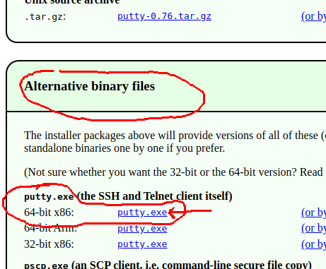
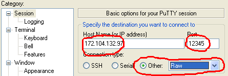
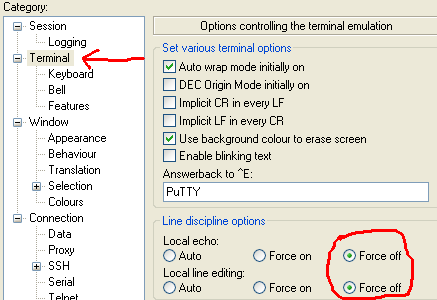

# catris

This is a Tetris clone for multiple players that connect to a server with netcat or PuTTY.


You can play on my server.
It's in Europe though, so the game may be very laggy if you're not in Europe.
Create an issue if this is a problem for you.

<details>
<summary>Windows instructions</summary>

Download PuTTY from [here](https://www.putty.org/),
or search "putty download" or similar and click the first result.
On the download page, choose the 64-bit x86 putty.exe under "Alternative binary files".



Open putty.exe from your downloads, and fill in these settings:
- Session: Host Name `172.104.132.97`, Port `12345`, Connection Type "Raw"



- Terminal: Local echo "Force off", Local line editing "Force off"



Then click the "Open" button to play.

</details>

<details>
<summary>MacOS/Linux instructions</summary>

To play on Mac or Linux, run on terminal:

```
stty raw; nc 172.104.132.97 12345; stty cooked
```

The `stty raw` in front is needed to send key presses to the server
as you press the keys, not when you press Enter.
If you forget it, you will get an error message that tells you to use it.
On some systems, the `stty` and `nc` commands must be ran at once using e.g. `;` as shown above,
instead of entering them separately.

</details>


## How to play

Before a game starts, you need to make a lobby.
If you want, you can share the lobby ID with your friends
so that they can join the lobby and play with you.

Keys:
- Ctrl+C, Ctrl+D or Ctrl+Q: quit
- Ctrl+R: redraw the whole screen (may be needed after resizing the window)
- WASD or arrow keys: move and rotate
- h: hold (aka "save") block for later, switch to previously held block if any
- r: change rotating direction
- p: pause/unpause (affects all players)
- f: flip the game upside down (only available in ring mode with 1 player)

There's only one score; you play together, not against other players.
Try to collaborate and make the best use of everyone's blocks.

With multiple players, if your playing area
fills up all the way to the top of the game,
you will have to wait 30 seconds.
Then your playing area will be erased and you can continue playing.
The game ends if all players are simultaneously on their 30 seconds waiting time.
This means that you can intentionally fill your area with blocks
to get your waiting time before other players.


## Development

If you're on Windows, use `py` instead of `python3` and `env\Scripts\activate` instead of `source env/bin/activate` below.

Running catris:

```
git clone https://github.com/Akuli/catris
cd catris
python3 -m catris
```

That's it.
Catris has no dependencies execpt Python itself,
so you don't even need a virtualenv to run it.
You can now connect to catris running on your computer
just like you would connect to my catris server,
but using `localhost` instead of `172.104.132.97` in the above instructions.

I recommend using a virtualenv for installing and running development tools:

```
python3 -m venv env
source env/bin/activate
pip install -r requirements-dev.txt
black catris        # Formats the code
isort catris        # Formats and sorts imports
mypy catris         # Type checker, detects common mistakes
pyflakes catris     # Linter, detects some less common mistakes
```

All these tools also run on GitHub Actions,
so you probably don't need to run them yourself
if you only want to make a couple small changes.
