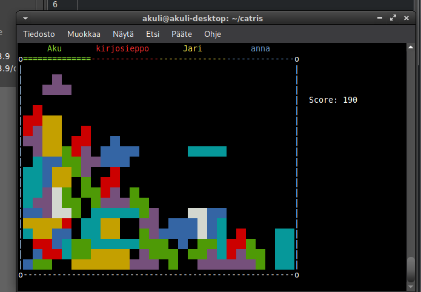

# catris

This is a Tetris clone for multiple players that connect to a server with netcat or a web interface.
You can play it here: https://akuli.github.io/catris/



My server is in Europe, so the game may be very laggy if you're not in Europe.
Please create an issue if this is a problem for you.


## High-level overview of the code

When the rust program starts, `main()` starts listening on two TCP ports,
54321 for websocket connections and 12345 for plain TCP connections (e.g. netcat).
The `web-ui/` folder contains static files served by nginx.
When running locally, the javascript code in `web-ui/` connects a websocket to port 54321.
On `catris.net`, it instead connects to port 443 (the default https port)
and lets nginx proxy the connection to port 12345 on the server;
this is done to work around firewalls that block outgoing connections on port 54321
without giving unnecessary privileges to the rust program.

After a client connects, it mostly doesn't matter whether they use
a websocket connection or a plain TCP connection,
as `connection.rs` abstracts the differences away.
Both connections use [ANSI escape codes](https://en.wikipedia.org/wiki/ANSI_escape_code) defined in `ansi.rs`.
This means that the javascript code in `web-ui/` must interpret ANSI codes,
but this also makes the rust code simpler:
it needs to use ANSI codes for raw TCP connections anyway.

The purpose of `ip_tracker.rs` is to limit the number of simultaneous connections for each IP address
and to log the IP if someone is creating many connections.
This way IP addresses of most users are only stored in RAM (as they would be anyways),
and not written to disk, as many users don't want me to know their IP address.
The IP address passed to `ip_tracker.rs` is determined in `connection.rs`:
it uses a header named `X-Real-IP` (set in the nginx configuration) when proxied through nginx,
and otherwise the IP that the connection to the rust program came from.
To keep track of how many clients are currently connected from each IP,
`ip_tracker.rs` also returns a token object that should be dropped when a client disconnects.

Next a `Client` object is created.
It is possible to receive and (indirectly) send through a `Client` object.
Specifically, `connection.rs` provides a method to receive a single key press,
and the `Client` object re-exposes it.
For sending, the `Client` has a `RenderData`.
Instead of sending bytes with `connection.rs`,
you usually set the `RenderData`'s `RenderBuffer` to what you want the user to see,
and then fire a `Notify` which causes a task in `main.rs` to actually send screen updates.
Only the changes are sent, the entire screen isn't redrawn every time.

Next:
- We ask the client's name.
- We ask whether the client wants to create a lobby or join an existing lobby.
- If the client wants to join an existing lobby, we ask its ID and join it.
- In the lobby, the client chooses a game.
- The client plays the game, using `ingame_ui.rs` to keep the `RenderBuffer` up to date.

Each item in the above list is a function in `views.rs`.
These functions take the `Client` as an argument, and send and receive through it.

Clients own their lobbies: a lobby is dropped automatically when all of its clients disconnect.
The lobby also knows about what clients it has, but it only contains `ClientInfo` objects,
not actual `Client` objects.
Unlike `Client` objects, the `ClientInfo` objects can't be used to send or receive;
they are purely information for game logic and other clients.

A lobby owns `GameWrapper`s, which take care of the timing and async aspects of a game.
Each `GameWrapper` has an underlying `Game` object from `game_logic/game.rs`,
and like the rest of the `game_logic/` folder, it's purely game logic without any async or IO.
For example, there are several async functions in `game_wrapper.rs`
that call methods of `Game` repeatedly
to e.g. move the blocks down or decrement counters on bombs.

Inside the `game_logic/` folder,
the `Game` object has `Player`s, and each `Player` has a `FallingBlock`.
Falling blocks and landed squares use `SquareContent` objects,
which usually define the color of a square,
but they can also be a special bomb or drill square.

When a player's block lands, the player gets a new block.
The block fails to land if it doesn't fit within the visible part of the game.
When that happens, the player has to wait 30 seconds before they can continue playing.
During that time, the player has a counter instead of a `FallingBlock`.
The game ends when all players are waiting simultaneously.

When the game ends, the `GameWrapper` records the game results by calling a function in `high_scores.rs`,
and sets the `GameWrapper`'s status so that `views.rs` notices it and displays the high scores.
When the client is done with looking at high scores, they go back to choosing a game.


## Development

You need to install rust (the compiler, not the game). Just google for some instructions.
I'm on a Debian-based linux distro, so I first tried `sudo apt install cargo`,
but it was too old and I had to use `rustup` instead.
You might have better luck with your distro's package manager
if you're reading this a few years after I wrote this
or if you're using a different distro.

Once you have rust, you can start the server as you would expect:

```
$ git clone https://github.com/Akuli/catris
$ cd catris
$ cargo r
```

When the server is running, you can connect to it with netcat:

```
$ stty raw; nc localhost 12345; stty cooked
```

If you want to develop the web UI, you need to run a web server in a separate terminal.
You need to have Python installed for this (or you could use some other web server instead).
If you're on Windows, use `py` instead of `python3`.

```
$ cd catris/web-ui
$ python3 -m http.server
```

You can then open `http://localhost:8000/` in your web browser.

Other commands (these also run on GitHub Actions):
- Formatter: `cargo fmt`
- Linter: `cargo clippy`


## Deploying

These instructions are mostly for me.
If you want to run catris in a local network, see [local-playing.md](local-playing.md).
If you run a bigger catris server, please let me know by creating an issue :)

Bump the version number and add a tag (so I know what's currently in production):

```
$ your_favorite_editor Cargo.toml
$ cargo build      # updates version number in Cargo.lock
$ git add Cargo.*
$ git commit -m "Bump version"
$ git tag v$(grep ^version Cargo.toml | cut -d'"' -f2)
$ git push --tags origin main
```

Look at `journalctl -fu catris` to make sure nobody is currently playing.
If in the future there is always someone playing,
use `/home/catris/catris_motd.txt` to clearly announce the downtime beforehand.

If you changed rust code, build the executable, copy it to the server, and restart the systemd service:

```
locally:    $ cargo build --release
locally:    $ ls -l target/release/catris
on server:  $ sudo systemctl stop catris
locally:    $ scp target/release/catris catris.net:/home/catris/catris
on server:  $ sudo systemctl start catris
on server:  $ journalctl -fu catris
```

If you modified the web UI, copy the contents of the `web-ui` directory to the server:

```
$ ls -a web-ui/
$ scp web-ui/* catris.net:/var/www/html/
```
