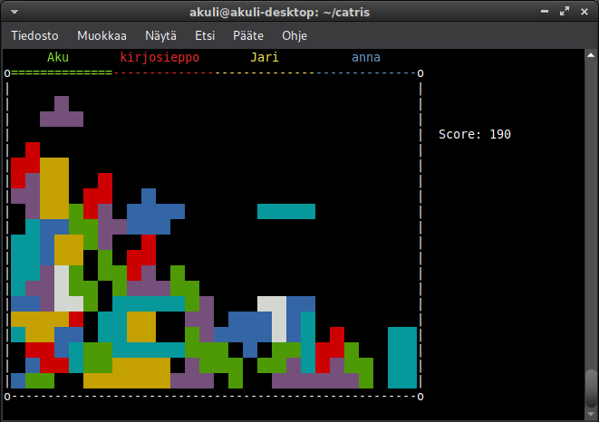

# catris

This is a Tetris clone for multiple players that connect to a server with netcat.



First, run the server:

```
$ git clone https://github.com/Akuli/catris
$ cd catris
$ python3 catris.py
```

To connect to it, open a new terminal and run:

```
$ stty raw
$ nc localhost 12345
```

The port is literally `12345`.
If the server is running on a different computer,
replace `localhost` with the server's IP or hostname.

If you forget `stty raw`, you will get an error message reminding you to run it first.
It is needed because otherwise you would have to press enter every time
you want to send something to the server.


## Gameplay tips

- There's only one score; you play together, not against other players.
    Try to collaborate and make the best use of everyone's blocks.
- If your game is over, you can leave (Ctrl+C, Ctrl+D or Ctrl+Q) and join again to play more!
    The score won't reset until everyone leaves at the same time.


## Troubleshooting

- If you are on Windows, you probably don't have netcat,
    and you can download it from somewhere.
    You could also just use WSL.
    Make an issue if you need help or you want me to write better instructions.
- If you are on MacOS, the raw mode doesn't exactly work as I expected.
    See [issue #6](https://github.com/Akuli/catris/issues/6).
    If you can get the game to work on MacOS, please let me know how :)
- If you use a firewall, you may need to tell it to allow listening on
    the port that catris uses.
    For example, for UFW this would be `sudo ufw allow in 12345 comment 'catris'`.
